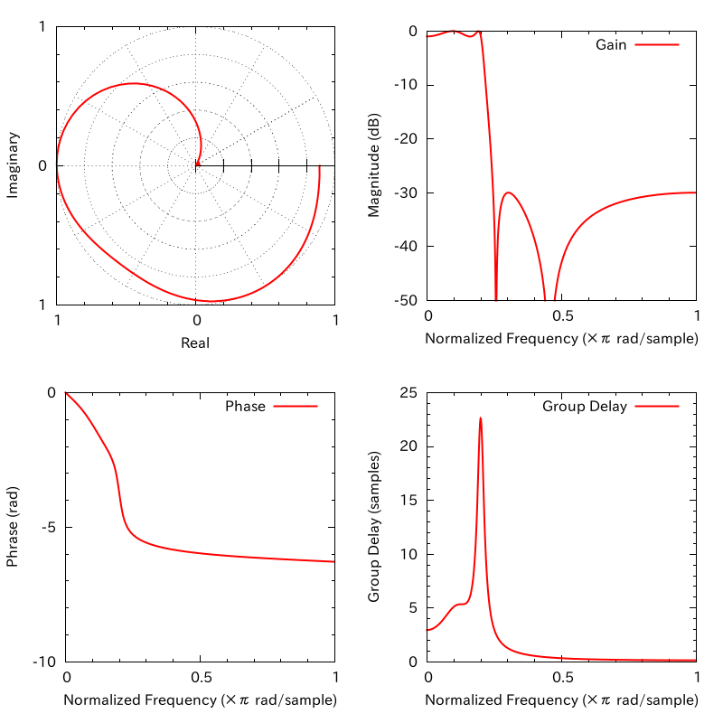

This tiny tool computes magnitude, phase characteristics and group delay from factors of IIR filter.

## Usage

    $ ./iir factor.txt out.dat

Each row of `out.dat` is consisted of five elements: frequency, magnitude, magnitude (dB), phase, and group delay (separated by a comma).

## Plot
    $ gnuplot show.plt

Or, if you want to export to PNG file:

    $ gnuplot png.plt

</img>

## Install

    $ git clone https://github.com/kmiya/iir.git
    $ cd iir
    $ make

## Setting

You can change settings in the `factor.txt`.

 - `begin`: Staring frequency [0,1)
 - `end`: Ending frequency (0,1]
 - `count`: Sampling interval. It should be `(end - begin) / [sampling freq]`, e.g., `0.001`.
 - `a` or `b` + [number]`: Factors of an IIR filter. `a` is for the numerator and `b` is for the denominator.

Transfer function is computed according to the following equation:
```math
H(z) = \frac{\sum^M_{m=0}a_mz^{-m}}{\sum^N_{n=0}b_nz^{-n}}
```

Note: This tool uses the convention of MATLAB, that is, unit frequency is the Nyquist frequency.

 > To convert normalized frequency to angular frequency around the unit circle, multiply by π.
 > To convert normalized frequency back to hertz, multiply by half the sample frequency.<br>
 > [Frequency Response - MATLAB & Simulink](http://www.mathworks.com/help/signal/ug/frequency-response.html)
